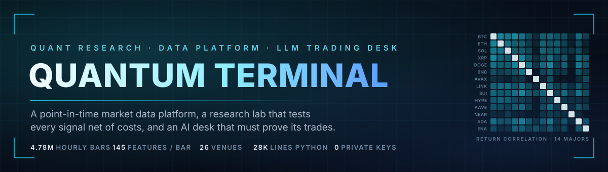
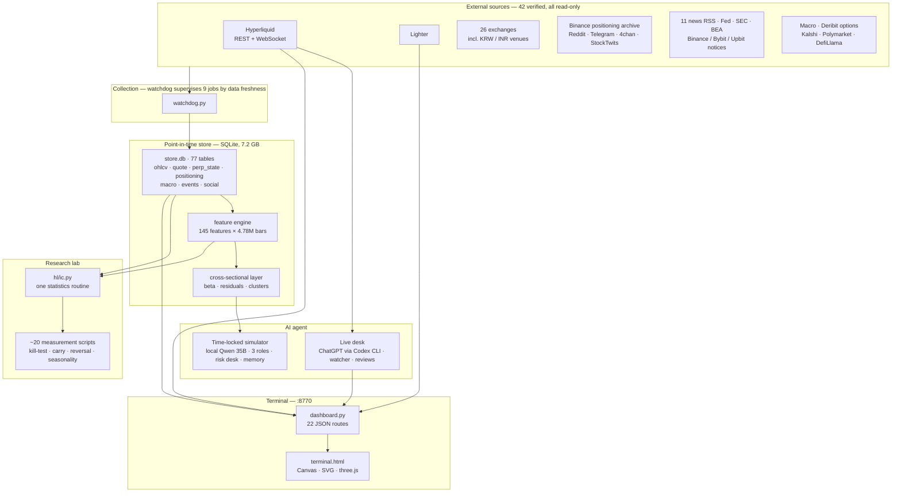
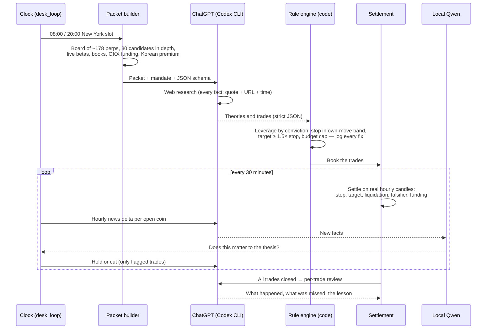
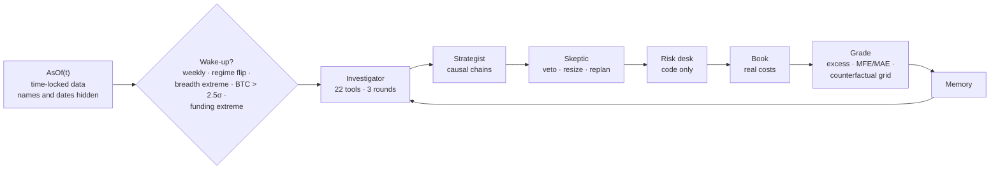

<div align="center">



<h3>A quant research desk for crypto perpetual futures, built to find out what is real.</h3>

<p><b>A live trading terminal, a point-in-time data platform, a research lab that tests every signal net of costs, and an AI trading desk whose every number is computed by code and whose every trade is settled on real exchange data.</b></p>

<p>


</p>

</div>

---

## Table of contents

- [What this is](#what-this-is)
- [Key features](#key-features)
- [System architecture](#system-architecture)
- [Prerequisites](#prerequisites)
- [Installation](#installation)
- [Configuration](#configuration)
- [The terminal](#the-terminal)
- [Data platform](#data-platform)
- [Research lab](#research-lab)
- [The simulator agent](#the-simulator-agent)
- [The live AI desk](#the-live-ai-desk)
- [Measured results](#measured-results)
- [Engineering principles](#engineering-principles)
- [Repository layout](#repository-layout)
- [Roadmap and status](#roadmap-and-status)
- [License](#license)

---

## What this is

Quantum Terminal is a solo-built research platform for trading perpetual futures on Hyperliquid, one of the largest on-chain derivatives exchanges. It starts from a blunt premise: **most trading signals are noise, and most AI trading demos are confident fiction.** Everything here is built to tell the difference.

It has four layers that share one data model:

1. **The terminal** — a single-page, Bloomberg-style dashboard served by a zero-framework Python backend. It shows a real multi-exchange portfolio (read-only), every tradable market, order books, funding, correlation, regime and risk, a live news river, a quant feature lab, and the AI desk's book.
2. **The data platform** — nine supervised collectors pulling from 26 exchanges, crowd and social sources, exchange announcements, macro and prediction-market feeds into a **bitemporal** SQLite store: 7.2 GB, 77 tables, 4.78 million hourly bars for 172 coins back to 2020, and 145 engineered features on every bar.
3. **The research lab** — one statistics routine, used by ~20 measurement scripts, that ranks coins against each other at each timestamp, corrects for overlapping windows, and charges real fees and spread. It rejected almost every idea it was given, and isolated one effect that survives.
4. **The AI agent** — first a time-locked historical simulator in which a local 35-billion-parameter model plays investigator, strategist and skeptic under a code-only risk desk; then a live paper desk that drives ChatGPT for web research, trade calls, watching and post-trade review.

Nothing in the repository can place an order. There is no private key, no signing code and no call to any trading endpoint. Every trade the system makes is a paper trade, settled against real market data.

---

## Key features

**Multi-exchange portfolio, reconciled two ways.** The portfolio reads Hyperliquid's main exchange *and every builder sub-exchange* (discovered dynamically from `perpDexs` and queried in parallel), plus Lighter perps and spot. Spot cost basis is rebuilt from fills with FIFO lot accounting, both venues' equity histories are step-merged onto one timeline, and all-time P&L is computed by two independent routes that must agree to within five cents or the panel raises an error.

**Point-in-time data store.** Every fact carries both `valid_from` and `observed_at`, so a backtest can only ask what was knowable at the time. No join ever uses a ticker string: every venue symbol maps to one canonical `asset_id` with a contract multiplier (Hyperliquid's `kPEPE` = Binance's `1000PEPE` = 1,000 × OKX's `PEPE`). A migration moved 4.9 million rows from 14 legacy databases into this schema.

**145 features with no look-ahead, proven.** Returns, nine volatility estimators (close-to-close, Parkinson, Garman-Klass, Rogers-Satchell, Yang-Zhang, EWMA, bipower, semi-vol, VaR/CVaR), trend, oscillators, bands, volume flow, risk and candle structure. A verifier recomputes each one a different way; six of its 22 checks truncate future bars and recompute — if a value changes, the feature was peeking.

**Cross-venue panel across 26 exchanges.** Every Hyperliquid coin priced on every reachable exchange every five minutes, including Korean and Indian venues quoting in their own currency. A conservative symbol parser, a staleness mask known *at the time*, and a median consensus price that one frozen venue cannot move.

**A research method designed to kill ideas.** Cross-sectional rank IC per timestamp (so "the market went up" cannot masquerade as signal), t-statistics on non-overlapping windows, a both-halves test, cost-inclusive books, and a **frozen-rank control** that exposed 100 of 435 "significant" results as coin-picking rather than timing.

**A time-locked agent simulator.** The model relives 2020–2026 one day at a time behind a single time-locked data door, with coin names and dates hidden. Three model roles reason in causal chains; a code-only risk desk with 15+ rules sizes and vetoes; a memory with Thompson sampling, decayed evidence and counterfactual grading learns from every closed trade.

**A live AI desk with provenance.** ChatGPT is driven headlessly through the OpenAI Codex CLI with JSON schemas enforced at the output layer. Every researched fact must carry a quote, a source URL and a timestamp or it is dropped. Code overrides the model on leverage, stop width, target distance and budget, and logs every correction on the trade.

**Sandboxed model-written code.** In raw mode the model receives only raw exchange rows and writes its own analysis in Python across several rounds; each script runs in an isolated interpreter with the socket layer patched to refuse all connections. One session produced a 777-column feature table for 330 perpetuals and two 330 × 330 correlation matrices.

**Tamper-evident records.** Paper trade plans, predictions and forward-tracker picks are content-hashed at creation. An edited call fails verification instead of quietly improving the record.

---

## System architecture



### One decision on the live desk



---

## Prerequisites

| Requirement | Minimum | Notes |
|---|---|---|
| Python | 3.10+ (3.12 tested) | Four third-party packages only |
| RAM | 8 GB | 28 GB+ if you also run the local 35B model |
| Disk | 10 GB | The full store with features is ~7.2 GB |
| OS | Windows 10/11 | Developed on Windows; the Python code is cross-platform, the launch scripts are PowerShell |
| Optional | llama.cpp + a Qwen3 GGUF | The simulator's local model, served on `:8080` |
| Optional | OpenAI Codex CLI + a ChatGPT plan | The live desk's research and reasoning model |

---

## Installation

### 1. Clone and install

```bash
git clone https://github.com/devanshagrawal0/quantum-terminal.git
cd quantum-terminal
pip install -r requirements.txt
```

`requirements.txt` is `requests`, `websocket-client`, `pandas`, `numpy`. Everything else is the standard library — the web server is `http.server`, storage is `sqlite3`.

### 2. Configure

```bash
cp .env.example .env
```

Every value is optional. With an empty `.env` the market pages, the data platform, the research lab and the desk all work; only the personal portfolio panel stays empty.

### 3. Run the terminal

```bash
python scripts/dashboard.py        # → http://localhost:8770
```

### 4. Start the collectors

```bash
python scripts/watchdog.py          # launches and supervises the 9 collectors
python scripts/watchdog.py --status # health: is each job's data still moving
```

### 5. Build history and features

```bash
python data_layer/collectors/binance_history.py --interval 1h --all   # 6.5 years of hourly bars, resumable
python data_layer/features/compute.py --all                           # 145 features per bar (disk-heavy)
```

### Verifying the install

```bash
python scripts/selftest.py              # 68 checks that can fail
python data_layer/features/verify.py    # 22 independent feature proofs — expect PASS 22 FAIL 0
python scripts/probe.py BTC             # live end-to-end proof against the real API, no mocks
```

---

## Configuration

All configuration is environment variables in `.env`, which is gitignored.

| Variable | Purpose |
|---|---|
| `HL_ACCOUNT_ADDRESS` | Public Hyperliquid address for the read-only portfolio view |
| `LIGHTER_L1_ADDRESS` | Public address used on Lighter |
| `LIGHTER_READONLY_TOKEN` | Lighter **read-only** token — cannot trade or withdraw |
| `CONTACT_EMAIL` | Optional contact sent in the User-Agent to public data APIs that request one |

The file header and `SECURITY.md` say it plainly: never put a private key, seed phrase or trading API key here. Nothing in the code would use one.

The live desk needs the Codex CLI signed in once (`codex login`); the connector never touches authentication itself. The simulator expects an OpenAI-compatible llama.cpp server on `127.0.0.1:8080`.

---

## The terminal

A single HTML file (3,421 lines, 93 functions, no framework) served by a single Python file (3,102 lines, standard library only). The design system is a set of CSS custom properties — near-black panels, one cyan accent, green/red for direction — built from a design mockup and specification (`docs/TERMINAL_DESIGN_SPEC.md`). Every external call is cached server-side (2 s for order books, up to 1 h for papers) and NaN/Infinity are scrubbed so every response parses.

### Tabs

| Tab | Panels |
|---|---|
| **Overview** | 3D Earth (three.js, bloom post-processing) with each region's session return computed from BTC's hourly bars inside that region's cash-market hours · Fear & Greed gauge · live news river with category chips · portfolio summary (net worth, window P&L, equity curve, allocation donut, deposited / all-time / unrealised) · canvas candlestick chart with 8 intervals and server-side EMA, Wilder RSI and MACD · watchlist and top movers by real 24 h volume · positions · **Risk Overview** · **Liquidation Map** · live order book · funding with next-settlement countdown · correlation heatmap · system status |
| **Research** | Market Regime Command · Macro Regime Monitor · Liquidity & Volatility · Liquidity Conditions · Venue Flow · Factor Performance (30D) · Quant Signals · relative-rotation graph · narrative strength · derivatives radar · research feed · paper digest |
| **Quant Lab** | Any of 172 coins from the feature store: price with Bollinger bands, volatility estimators, momentum, trend, risk, flow and candle panels, oscillator strip, timeframe switch, and a browser of every computed feature with coverage status |
| **Desk** | The AI desk's book: KPI strip, positions blotter with per-trade sparkline and a stop · now · target bar, best and worst point reached, falsifier and checkpoint status pills, book exposure, realised P&L across runs, the research cards the model used (each with its source), the decision, and the post-trade review; run selector |

### What the analytics actually compute

| Panel | Method |
|---|---|
| Risk Overview | Historical 95% VaR and expected shortfall of the *actual* live positions, from 90 days of daily log returns weighted by signed notional; rolling 20-day VaR/ES series; Herfindahl concentration; gross leverage; 30-day return, volatility, Sharpe, win rate and max drawdown |
| Liquidation Map | Signed distance from mark to each position's liquidation price, cumulative notional at risk below and above, with a stated risk policy |
| Macro regime | `0.60 × tanh(3 × distance from 50-day SMA) + 0.40 × (1 − 20-day vol percentile)`, smoothed over 5 days; RISK-ON ≥ 60, RISK-OFF ≤ 40; label duration; live breadth across every market |
| Liquidity & Volatility | US Treasury General Account balance (Fiscal Data API), total stablecoin supply (DefiLlama), VIX, S&P 500 and BTC 30-day realised vol, Deribit DVOL implied-vol index; a composite 0–100 stress score |
| Relative rotation | JdK-style RRG of the nine largest markets against BTC: RS-ratio and RS-momentum as rolling z-scores, EMA-smoothed, with a 7-week tail |
| Factor performance | Long-short tercile portfolios on momentum, low volatility, carry and liquidity over 30 days: cumulative return, information ratio, z-score |
| Correlation | Pearson correlation of daily log returns on the common date set, so every pair is measured over the same days |
| News | 11 publisher RSS feeds, three regulator/statistics feeds and three exchange announcement feeds, fetched in parallel, de-duplicated, categorised by the *publisher's own tags* — never by keywords in the headline — with per-source freshness and silent-source detection |

### API

| Route | Returns |
|---|---|
| `/api/portfolio?tf=` | Combined Hyperliquid (main + builder exchanges + spot) and Lighter account, equity curves, reconciliation |
| `/api/market` | One row per tradable perp: funding, basis, open interest, regional premia, crowd positioning, cross-sectional ranks |
| `/api/overview?tf=` | Global market stats, Fear & Greed, regional session returns |
| `/api/candles`, `/api/orderbook`, `/api/funding`, `/api/watchlist`, `/api/correlation` | Market microstructure |
| `/api/regime`, `/api/risk`, `/api/liqvol`, `/api/research` | Analytics above |
| `/api/news`, `/api/papers`, `/api/tradfi` | News, arXiv quant-finance papers, S&P 500 / VIX / DXY / US10Y |
| `/api/coin`, `/api/graph` | Per-coin dossier; cause-and-effect connection map with ranked signals |
| `/api/quant?what=` | Feature store: coins, coverage, snapshot, series |
| `/api/desk?run=` | AI desk runs with live settlement |
| `/api/book` | The paper trading engine: open and closed positions, triggers, alerts, journal |
| `/api/health` | Real probes of every upstream with latency — a check that can fail |

---

## Data platform

### Collectors

`scripts/watchdog.py` launches and supervises every job. Health is defined as **"is the data still moving"** — the age of each job's newest row against its own threshold — not "is the process alive". A job that hangs with its process intact is restarted.

| Job | Collects | Cadence |
|---|---|---|
| `record_venues.py` | Every Hyperliquid coin on every reachable exchange | 5 min |
| `record_social.py` | Telegram, Reddit, 4chan, StockTwits — raw and unscored, with claimed-publish, fetch and first-seen timestamps | 3–10 min |
| `record_events.py` | Listings, delistings and notices; a structural diff of Hyperliquid's own universe | 2 min |
| `settle_loop.py` | Marks every paper position against the consolidated cross-venue price; closes on stop, target or time | 1 min |
| `trigger_loop.py` | Evaluates armed conditional triggers against live price; opens the planned trade and raises an alert | 30 s |
| `backfill_positioning.py` | Binance crowd positioning and open interest from the public archive, one file per coin per day, resumable | hourly |
| `unlocks_refresh.py` | Token-unlock calendar with size and share of max supply | 6 h |
| `tracker_loop.py` | Forward score-tracker: hashed daily picks graded after a 10-day hold against BTC | 6 h |
| `data_layer/store/sync.py` | Streams new rows from the collector databases into the unified store | 1 min |

On-demand collectors add 6.5 years of hourly history from Binance's public archive, the Deribit options chain with Black-Scholes greeks computed locally, macro series, regulatory documents, Kalshi and Polymarket, and reference data.

### Sources

64 external sources were each handled the same way: read the documentation, call the endpoint, check the payload contains what the documentation promises, then label it. Status, HTTP code, latency, rate limit and a sample payload are stored per source. **42 verified, 10 need a free key, 12 removed** with the reason recorded. Network traps found along the way — an exchange API returning HTTP 451 by region, an ISP hijacking DNS — are handled in code rather than papered over.

### The store

| Table | Rows | Contents |
|---|---|---|
| `ohlcv` | 4,775,775 | Hourly bars, 172 coins, 2020-01-01 → 2026-08-31 |
| 8 × `feat_*` | ~4.78M each | 145 features per coin per hour |
| `quote` | 5,412,279 | Cross-venue quotes: 26 venues, 179 coins, 3,431 pairs |
| `perp_state` | 316,007 | Funding, open interest and mark snapshots |
| `feat_cross` | 191,845 | Beta, R², residual returns, idiosyncratic vol, clusters |
| `positioning` | 178,042 | Top-trader and account long share, open interest |
| `macro_series` | 73,356 | Fed funds since 1954, US 10-year, ECB, EUR/USD, Fear & Greed |
| `social_post` | 25,180 | Raw crowd text |
| `prediction_market` | 8,500 | Kalshi and Polymarket |
| `event_instance` | 588 | FOMC, CPI, NFP 2021–2026, options expiries, listings, unlocks |

Schema rules are enforced in `data_layer/store/schema.sql`, and `data_layer/store/store.py` is the only module permitted to write to the store.

### Cross-sectional layer

`sim/xsec.py` computes, as of every day and from nothing later: 60-day OLS beta to BTC with **Vasicek shrinkage** toward the cross-sectional median weighted by each estimate's standard error, R², residual returns and idiosyncratic volatility, crash-day beta, calm and stressed correlation matrices, the first principal component's share, and residual-correlation clusters.

---

## Research lab

### Method

`hl/ic.py` is deliberately the only statistics implementation in the project, because two copies of a statistics routine drift and the older one keeps printing plausible numbers.

- **Per-timestamp ranking.** Rank coins by the feature and by what happened next *within each timestamp*, correlate, then average across time. Pooling everything into one regression measures the market, not the signal — that mistake once produced a 1-day signal that reversed sign when measured properly.
- **Overlap correction.** t-statistics on non-overlapping windows only.
- **Both halves.** An effect must appear in the first and second half of history.
- **Costs.** 4.5 bps taker fee plus half the measured spread on each side, and hourly funding.
- **Self-tests.** Feeding a coin's own future return scores +1.000; random and shuffled features score ≈ 0.

### What survived and what did not

| Test | Verdict |
|---|---|
| Kill-test: 145 features × 3 horizons, 2,435 days, 435 tests | **No single feature is a tradeable 3–7 day signal.** 100 passes were exposed by a frozen-rank control as coin-picking: volatility "predicted" returns only because calm large caps beat volatile alts over 2020–2026 |
| 1-day reversal on the 20/40/80 tightest-spread coins | Statistically real (IC +0.034), **dead as a trade**: −16 to −19 bps/day after costs, no positive year |
| Residual 7-day momentum | t +1.0 to +1.3 after overlap correction — indistinguishable from zero |
| Crowd positioning | IC +0.013, below the cost bar |
| **Funding → 7-day excess return** | **Survives.** Rank IC −0.027, t −3.8 over 377 daily cross-sections. Counting the funding itself, being long the most crowded-short quintile earned **+101 bps per week** (48 bps collected, 54 bps price); shorting the crowded-long quintile earned roughly nothing. The long-short pair: +95 bps per week, t 4.05 |
| Beta and correlation structure | Median beta 1.10, median R² 0.30; average pairwise correlation 0.38 on calm days and **0.76 on the worst 10% of BTC days**; on BTC crash days low-beta alts fell as far as high-beta alts |

Further scripts cover beta-hedged carry, listing shorts, fading blow-offs, overhead supply, breakouts, regime timing and calendar seasonality (FOMC, CPI, weekday), each with the same cost and both-halves gauntlet.

### Accountability instruments

| Instrument | What it does |
|---|---|
| Prediction log | Calls written before the outcome exists, content-hashed, scored against the equal-weight market and 40 random control calls |
| Forward tracker | Hashed daily picks graded out of sample after 10 days |
| Pre-trade enforcement | Blocks shorts into a melt-up regime and correlated over-concentration, using measured correlation to the actual book |
| Trade journal and dossier | Signals snapshotted at entry, a post-mortem per closed trade, a generated rulebook and mistake catalogue |

---

## The simulator agent

A historical environment for testing whether a language model can trade — and for building the scaffolding that makes it trade better.



| Component | Detail |
|---|---|
| **Time lock** | `sim/data.py` is the only door to the data; every accessor takes the simulation clock and returns only what existed by then |
| **Investigator** | Thinking off; up to three rounds of six tool calls over 22 tools — market table, regime, correlations, positioning, funding, funding extremes, open interest, Fear & Greed, macro, scheduled events, links, calendar, event history, cross-venue, similar situations, evidence, stops report, insights, calibration, market view, recall, write note — each result stamped with its source |
| **Strategist** | Thinking on; must write *observation → mechanism → expected move → falsifier → checkpoint → order → confidence* |
| **Skeptic** | Receives an engine-built counter-dossier per order; must name the weakest and rule on each |
| **Risk desk** | Stop 1.5–3.0 idiosyncratic daily moves; falsifier on the wrong side and inside the stop; target ≥ 2 daily moves and ≥ 1.5× the stop; minimum hold from √-time scaling; ≤ 2 positions per residual cluster; beta band; net/gross beta cap; 3σ BTC stress loss ≤ 10% of risk capital; a funding rule taken from the measured link; **quarter-Kelly × volatility-target sizing**; confidence shrunk toward 0.5 by the agent's own record and mapped through its calibration table; CVaR and drawdown brakes |
| **Engine** | Same cost model as the live paper book; stops and targets against the day's range; grading by excess return over the universe; best and worst point reached; the same entry replayed under nine stop/target plans and the opposite side |
| **Memory** | Experience rows; evidence per setup with a 90-day half-life; k-nearest-neighbour "similar situations" over stored feature vectors; **Thompson sampling** so a losing setup is tried less rather than banned; rules that become active only after ten agreeing out-of-sample trades; calibration buckets |
| **Links engine** | Lag-augmented local projections (Montiel Olea & Plagborg-Møller, 2021), day fixed effects, day-clustered errors, admission only at \|t\| ≥ 3 with a stable sign |
| **Event store** | FOMC, CPI and NFP 2021–2026 from the Fed and BLS calendars, options expiries, listings, unlocks, trading sessions |
| **Evaluation** | A 15-category benchmark on an absolute 0–100 scale, scored mechanically from run artefacts rather than the model's own words; 68 automated self-tests |

The design rule came from measurement. On a 42-question exam the model recited the rules correctly, then broke them minutes later while trading, flipped the sign of funding in one phrasing out of three, and got arithmetic wrong. So **every number and every sign is computed by code and handed over as a fact; the model only proposes mechanisms.** A 12-chapter, ~20,000-word desk manual (`docs/manual/`) teaches it to read those facts, with every figure either measured in the store or cited.

---

## The live AI desk

| Module | Role |
|---|---|
| `sim/codex_backend.py` | Drives ChatGPT headlessly through `codex exec`: prompt on stdin, `--output-schema` for strict JSON, `--json` event stream for token usage and every web search made, reasoning effort per call, one folder per call with prompt, schema, answer and events. Facts without a source URL are dropped |
| `scripts/desk_packet.py` | Builds the packet from free public endpoints: the whole board of ~178 perps, ~30 candidates in depth with multi-horizon returns, realised vol, own daily move and stop band, **betas recomputed live** from 90 days of candles, order-book spread and depth, OKX funding, the Korean premium, dominance, sentiment, calendar tilts and the desk's own record |
| `scripts/desk_call.py` | *Structured* mode (ask → research → call) or *deep* mode (one unbounded research session that must write theories with a mechanism and a kill condition before trading); rule enforcement; settlement; per-trade review |
| `scripts/desk_loop.py` | The clock: settles open runs, runs the hourly watcher (news delta → local-model triage → hold or cut), reviews closed runs, and fires new calls at 08:00 and 20:00 New York time |
| `scripts/desk_raw.py` | Raw mode: 13 raw data files, model-written analysis executed in a network-blocked sandbox over several rounds, then a research-and-trade session on its own computed features |

**Two-level model blend.** A local Qwen model — free, always on — does cheap triage such as "does this hour's news matter to this open trade?". ChatGPT does the research, the calls, the watching decisions and the reviews. Code owns every number and every rule.

**Settlement** runs on real Hyperliquid hourly candles: stop before target on the same bar, liquidation when leverage × adverse move reaches 100%, the falsifier exit at the close of its hour, watcher cuts, 4.5 bps fee plus 3 bps half-spread per side, and real funding from the exchange's funding history. Each trade records R multiple, best and worst excursion, and whether its checkpoint was hit.

---

## Measured results

These are reported as measured, including the unflattering ones.

| Experiment | Result |
|---|---|
| Rule agents 2021–2026, $100 per trade, real costs | Trend rule −$578, random control −$996, learning-trend agent (Thompson sampling) **+$62** — better than both controls, negative in three of six years |
| 15-category agent benchmark | Mean rose from 6.5 to ~32 of 100 across builds, on a scale where 100 means a validated world-class desk |
| Model knowledge exam | 58 → 84.5 with the desk manual attached (open book) |
| Paper book, August 2026 | 75 trades on a $50 book, **−$38.20**; the losses produced the concentration and regime rules the pre-trade check now enforces |
| Live desk, first structured run | 5 trades: two targets, two stops, one left open; about +$1.64, about +$8.16 on replay with the falsifier exits enforced |
| Live desk, deep run | 32 live searches, 0 trades; the market then rotated into alts with BTC flat, which the session had read as a narrow rebound |
| Raw mode | 777 features × 330 perps computed from raw rows in a sandbox; the trading session hit the provider's usage cap |

No trading profit is claimed. The contribution is the infrastructure and a method that tells real effects from noise.

---

## Engineering principles

- **Point-in-time everywhere.** Bitemporal storage, a single time-locked data door for the agent, first-seen timestamps for social posts, truncation tests for features.
- **Checks that can fail.** Verification recomputes a value a different way; self-tests prove the test itself can detect a planted signal.
- **Code owns numbers; the model owns reasoning.** A decision made from measured model failure modes, not taste.
- **Provenance.** Every fact the model uses carries a URL and a time, or it is dropped.
- **Tamper evidence.** Plans and predictions are hashed when written.
- **A graveyard, kept.** Rejected ideas are recorded with the test that rejected them (`docs/trading/STRATEGY.md`, `docs/KILL_TEST_2026-09-13.md`).
- **Read-only by construction.** No key, no signing, no order endpoint, anywhere.
- **Operations measured.** The store was moved out of a synced folder after measuring a 37-deep disk queue; backfills are resumable, newest-first, paced and backed off.

---

## Repository layout

```
scripts/                 entry points
  dashboard.py             terminal backend · 22 routes · stdlib only
  terminal.html            terminal frontend · Canvas · SVG · three.js
  watchdog.py              supervisor for the 9 collectors
  record_*.py              venue, social, event collectors
  desk_*.py                live AI desk: packet, call, loop, raw mode
  measure_* · backtest_* · kill_test.py · seasonality.py …   research lab
  selftest.py · benchmark.py · probe*.py                       verification
hl/                      exchange client and live analytics (42 modules)
  info.py · ws.py · ratelimit.py · meta.py                     read-only Hyperliquid client
  crossvenue.py · exchanges.py · venues.py · tier0.py          26-venue panel
  regime.py · macro_regime.py · rotation.py · risk.py · radar.py   market brain
  paper.py · journal.py · preflight.py · predictions.py · tracker.py   paper book and accountability
  ic.py                                                        the one statistics routine
data_layer/              unified store
  store/                   schema.sql · store.py · migrate.py · sync.py
  collectors/              Binance archive · Deribit · macro · news · prediction markets · reference
  features/                compute.py (145 features) · verify.py (22 proofs)
  registry/sources.yaml    the 64 sources
sim/                     the agent
  data.py · tools.py · investigator.py · risk.py · engine.py · memory.py
  xsec.py · links.py · events.py · agents.py · run.py · codex_backend.py
docs/                    dated experiment write-ups and specifications
  design/                  the long-term vision, pipeline, build plan, terminal mockup
  trading/                 strategy, rules and lessons, market dynamics, generated trading dossier
  manual/                  the 12-chapter desk manual the agent reads
research/                ~7,300 lines: driver taxonomy, world context, news impact, market mechanics, cross-venue features
```

`data/` (databases, logs, model sessions) and `.env` are not committed.

---

## Roadmap and status

### Shipped

| Area | Notes |
|---|---|
| Terminal — Overview, Research, Quant Lab, Desk | Live data on every panel; unavailable feeds are labelled rather than faked |
| Data platform | Collectors, supervisor, unified store, 145 features, verification |
| Research lab | Method, ~20 measurement scripts, dated results |
| Simulator | Three model roles, risk desk, memory, benchmark, self-tests |
| Live desk | Connector, packet, structured / deep / raw modes, settlement, reviews, watcher |

### In progress

| Area | Current state |
|---|---|
| Terminal | Eight further tabs (Markets, Portfolio, Trading, News, Data, Strategies, Execution, Risk) are placeholders |
| Links engine | Built; 48 candidate links stored, none admitted yet |
| Desk packet | Breadth and rotation history, and open holdings, to be added after the deep run missed an alt rotation |
| Scheduling | The desk loop runs on demand, not as a service |

### Planned

| Area | Notes |
|---|---|
| News pipeline for the agent | Claims with quote, source and time from GDELT and RSS |
| Event consensus and surprise | FOMC / CPI / NFP consensus from prediction markets |
| Known bug | Unlock rows in `event_instance` store timestamps in the wrong unit |

---

## License

Released under the [MIT License](./LICENSE).

> [!WARNING]
> This is research software. Nothing here is financial advice. The system is read-only and trades on paper; no result shown here is evidence that any strategy will make money. Market data comes from free public sources and may be delayed, incomplete or wrong.
